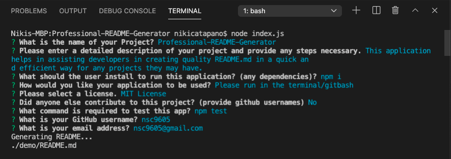
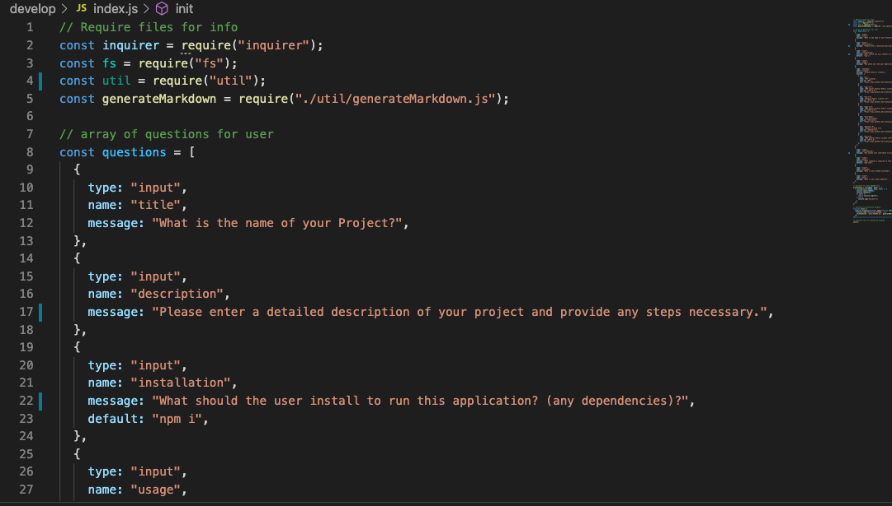
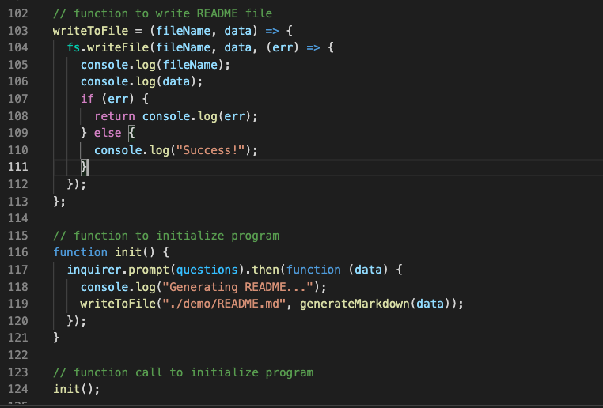
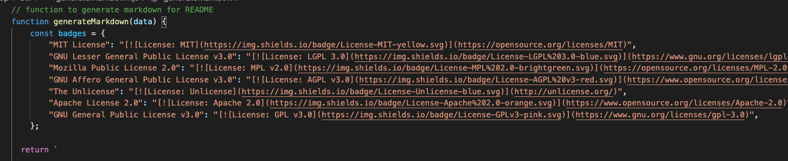

  
  # Professional-README-Generator 
  [](https://opensource.org/licenses/MIT)
  

  ## Description
   This application aims to assist developers with a template design to create a professional, quality README.md file in an efficient and clean way. When the application runs, it presents a series of prompts for the user to answer that will help build a proper README.md file. The user is taken step by step through each section that a README should have for each application--ensuring they never forget important sections! The user will be asked to provide the following:

   * Name of their project
   * Detailed description of the project
   * Installation requirements to run the project
   * How the application should be used
   * Select a license from the given options
   * List any collaborators with github username (if any)
   * How to test the application
   * Github username
   * Email address

   This information is then used to fill out the Professional README Generator template provided by the generatedMarkdown file. This newly generated README is then saved in the demo folder.

  ## Table of Contents
  

  * [Demonstration](#demonstration)
  * [Installation](#installation)
  * [Usage](#usage)
  * [License](#license)
  * [Technologies](#technologies)
  * [Questions](#questions)
 

  ## Demonstration
  Examples of views in the command line of the application: 
  

  Code snippets:
  

  

  


  GIF of walk through video:

  


  For a full demonstration, please click: [Walk Through Demo](https://youtu.be/73_CB5p1jHg)


  ## Installation
  This application requires the installment of 'inquirer' and 'fs' to run properly. To install the required dependencies, please run:
  ```
      npm i
  ```

  ## Usage
  After the required dependencies are installed, please navigate into the 'develop' folder containing index.js and run the following command line:
  ```
    node index.js
  ```

  ## License
  This application is licensed under the [MIT License](https://opensource.org/licenses/MIT)


  ## Technologies 
  * [Node.js](https://nodejs.org) 
  * [Inquirer](https://npmjs.com/package/inquirer)
  * [VS Code](https://code.visualstudio.com/)


  ## Questions
  For any other questions about this project, please visit my GitHub page:
      [GitHub Profile](https://github.com/nsc9605/Professional-README-Generator)
    
  Or you can email me directly at: [Nicole Catapano](mailto:nsc9605@gmail.com)
  
